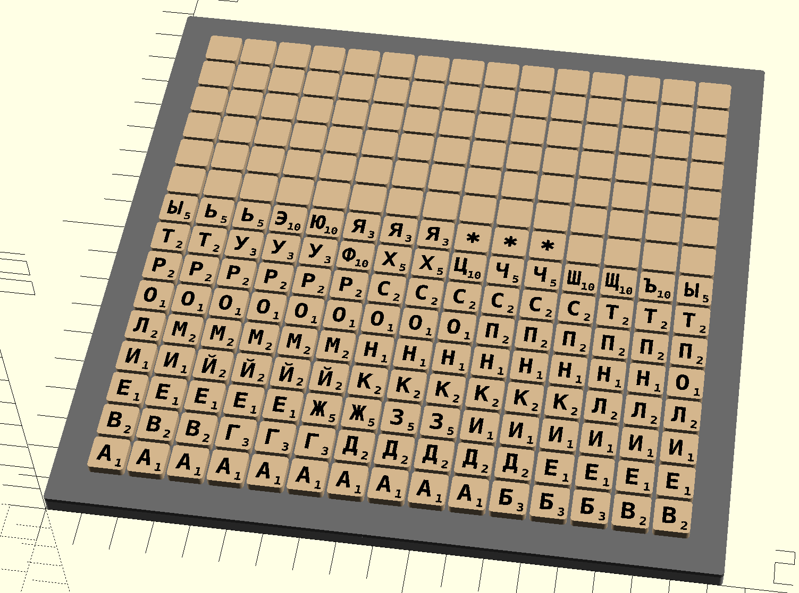
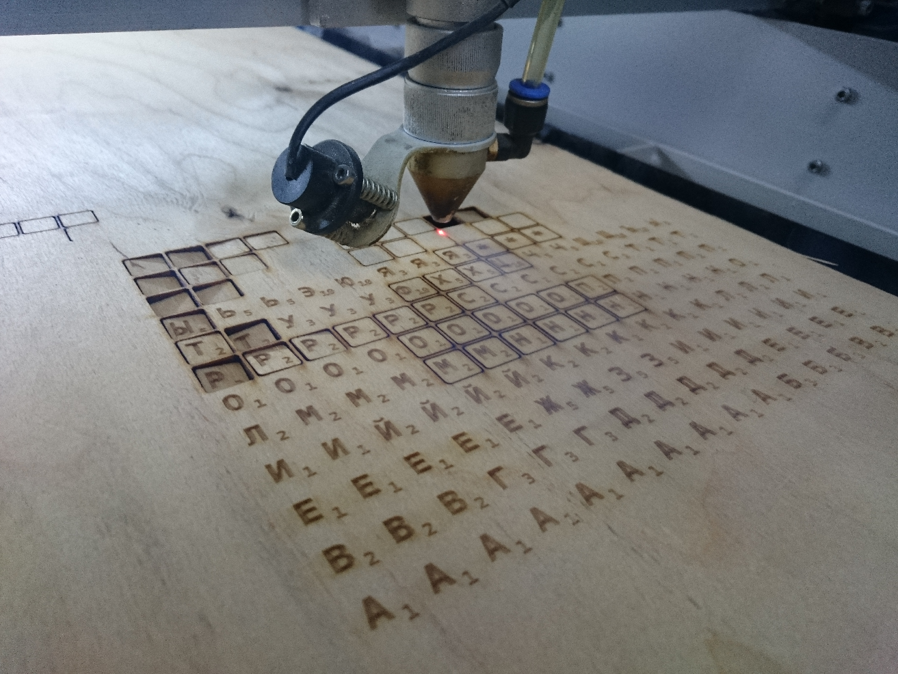
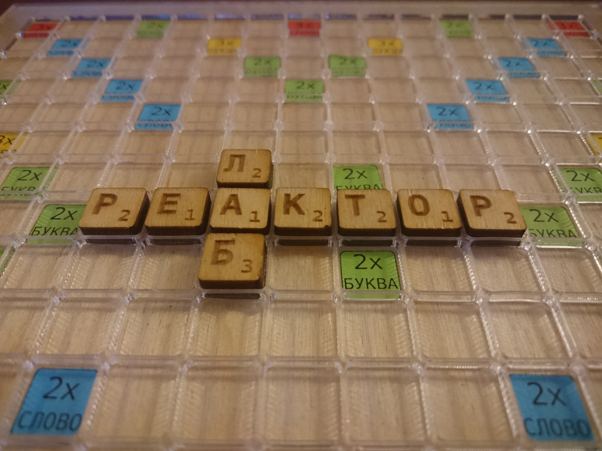

# Board games

Board games made with OpenSCAD. Each board layer can be exported separately to `dxf` or `svg` for a laser cutting machine.

## Word games

There is a base `wordgame.scad` file for a parameterized word board game.

### The `erudit`
Example word game `erudit.scad` (it is very similar to the scrabble game):

